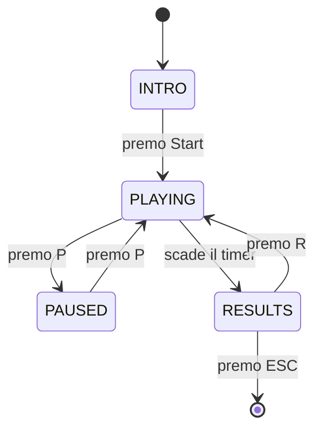

# Architettura

> Qui spiegate **come è fatto dentro** il progetto. Non ripetete il testo della specifica: scrivete cosa avete fatto voi, come lo avete organizzato, e perché.

## Decomposizione in moduli

Per ciascun modulo del vostro progetto, una-due righe:

- `main.py` — Il punto di ingresso che orchestra il game loop e smista gli eventi tra i vari moduli.
- `config.py` — Contiene tutte le costanti (colori, dimensioni, tempi, tasti) per evitare "numeri magici" nel codice.
- `models.py` — Definisce le strutture dati (Trial, GameState) usando le @dataclass.
- `rules.py` — Contiene la logica pura per validare le risposte (es. "è una vocale?", "è pari?").
- `scoring.py` — Gestisce il calcolo del punteggio, i meter e i moltiplicatori.
- `generator.py` — Crea i trial casuali assicurandosi che siano bilanciati e riproducibili tramite seed.
- `states.py` — Definisce l'Enum GameState per gestire i passaggi tra le varie fasi del gioco.
- `ui.py` — Si occupa esclusivamente del rendering grafico e della gestione dei font.
- `input_handler.py` — Traduce gli eventi di basso livello di Pygame in azioni logiche per il gioco.

Se avete aggiunto/rimosso moduli rispetto alla struttura suggerita, spiegate perché.

## Separazione logica / presentazione

Quali moduli sono "puri" (non importano pygame)? Quali sono legati al rendering? Come comunicano fra loro?

Se avete fatto scelte non ovvie (es. passare lo stato come parametro invece che come variabile globale), spiegate il ragionamento.

Abbiamo cercato di seguire rigorosamente la separazione tra logica e presentazione:
Moduli Puri: rules.py, models.py, scoring.py e generator.py non importano Pygame. Possono essere testati da riga di comando e non sanno nulla di pixel o finestre.
Moduli di Presentazione: ui.py e main.py gestiscono il rendering.
Comunicazione: Il main.py funge da "ponte". Riceve i dati dai moduli logici (es. un nuovo trial) e li passa al modulo UI per il disegno. Non usiamo variabili globali: lo stato del gioco (GameState) viene passato come riferimento alle funzioni che devono consultarlo o modificarlo.

## Macchina a stati

Diagramma della macchina a stati (Mermaid va benissimo, è supportato da GitHub):

Spiegate brevemente ciascuno stato: cosa fa, cosa disegna, quali input ascolta, verso quali stati può transire.

INTRO: Mostra il titolo e le istruzioni iniziali. Aspetta l'input per iniziare.
PLAYING: Lo stato attivo. Gestisce il timer, i trial, lo scoring e il feedback visivo.
PAUSED: Congela il timer e mostra un overlay di pausa. Impedisce di rispondere ai trial.
RESULTS: Mostra il punteggio finale, la precisione e la miglior streak. Permette di ricominciare.

## Flusso di un trial

Descrivete il ciclo di vita di un singolo trial, dall'istante in cui il generatore lo crea all'istante in cui viene archiviato nelle statistiche. Dove nasce? Come viene valutato? Chi aggiorna lo scoring? Chi attiva il feedback?

Un diagramma di sequenza Mermaid aiuta molto qui.

sequenceDiagram
    participant G as Generator
    participant M as Main Loop
    participant I as Input Handler
    participant R as Rules
    participant S as Scoring
    participant U as UI

    G->>M: Crea nuovo Trial (Lettera, Numero, Posizione)
    M->>U: Renderizza Trial a schermo
    I->>M: Rileva pressione tasto (YES/NO)
    M->>R: Verifica correttezza rispetto a posizione
    R->>M: Risultato (Correct/Wrong)
    M->>S: Aggiorna Meter, Multiplier e Score
    M->>U: Attiva Feedback visivo (verde/rosso)
    M->>G: Richiede prossimo Trial

## Dati principali

Le vostre `dataclass` principali (`Trial`, `ScoringState`, `SessionStats`): cosa contengono, chi le crea, chi le modifica.

Usiamo due dataclass fondamentali:

Trial: Contiene i dati grezzi della sfida attuale (lettera, numero, posizione, risposta attesa). Viene creato dal Generator.
GameState: È il "cuore" della sessione. Contiene il punteggio, il moltiplicatore, il meter, il tempo rimanente e il feedback attivo. Viene modificato da Scoring e Main.

## Scoring: come è implementato

Due righe di riassunto del sistema (meter, moltiplicatore, bonus) e riferimento al file dove sta il codice. Non ripetete la formula della specifica — spiegate come l'avete tradotta in codice voi.

Il sistema vive in scoring.py. Abbiamo tradotto la formula della specifica usando un sistema a soglie: ogni risposta corretta riempie un meter. Quando il meter raggiunge la capienza massima, il moltiplicatore aumenta (fino a 10) e il meter si resetta. Un errore svuota il meter o, se già vuoto, abbassa il moltiplicatore. Questo rende lo scoring dinamico e premia la costanza.

## Generatore: bilanciamento e seed

- Come evitate streak lunghe? Per evitare streak troppo lunghe e prevenire il "button mashing", abbiamo implementato un sistema di re-roll nel generatore:
Il generatore tiene traccia della risposta attesa degli ultimi due trial.
Se il terzo trial generato casualmente produce la stessa risposta dei precedenti, viene scartato e rigenerato. Questo garantisce che non ci siano mai più di tre risposte identiche consecutive, forzando il giocatore a mantenere alta l'attenzione e a "shiftare" effettivamente il compito cognitivo.

- Come bilanciate YES/NO? Il generatore assicura che non ci siano più di 3 risposte identiche consecutive (es. non più di 3 "YES" di fila) per evitare che il giocatore prema a caso.

- Come funziona il seed? Come lo testate? Usiamo random.Random(seed). Questo ci permette di avere sequenze di carte identiche durante il debug o i test automatici, garantendo che i bug siano riproducibili.

## Fading istruzioni

Come è implementato tecnicamente? Dove vive la variabile «quante risposte corrette finora»? Chi la aggiorna? Come si trasforma in opacità?

Il fading è gestito in ui.py. La variabile correct_answers_count nello stato del gioco determina l'opacità del testo delle istruzioni.
0-4 risposte: Opacità 100% (Alpha 255).
5-8 risposte: Opacità 50% (Alpha 128).
9+ risposte: Opacità 0% (il testo non viene più renderizzato).
Questo aiuta il giocatore a memorizzare le regole senza affollare l'interfaccia per tutta la partita.

### Domande-guida

1. Se un compagno apre il progetto per la prima volta, capisce dove cercare cosa?
2. Avete spiegato **perché** le vostre scelte, o solo **cosa** avete fatto?
3. I diagrammi Mermaid si aprono correttamente su GitHub? (Verificate nel browser.)
4. Qualcuno che legge solo questa pagina riesce a farsi un'idea corretta dell'architettura?
